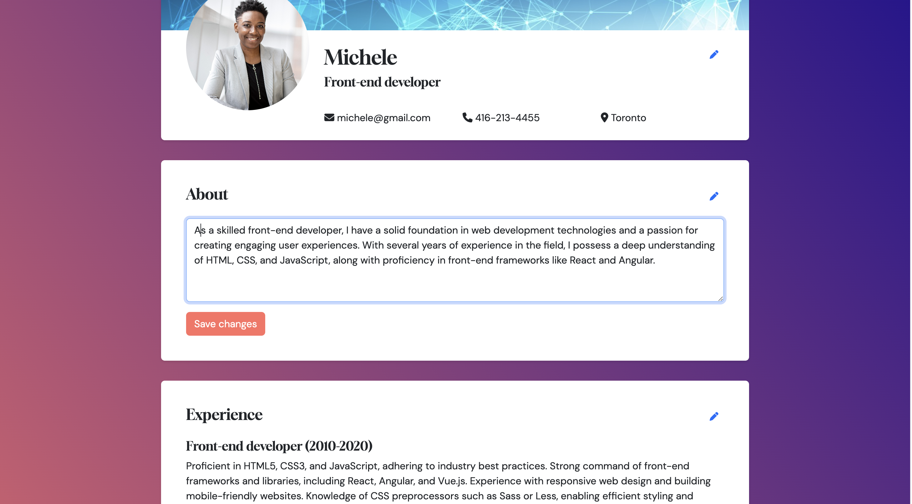

# JobLeap

JobLeap is a cutting-edge application that revolutionizes the job search experience. With JobLeap, users can effortlessly create personalized profiles and instantly access a curated list of job opportunities that align with their specific criteria. Seamlessly applying for jobs is made even easier as our integrated ChatGPT API dynamically modifies resumes based on individual requirements. Whether opting for the original or modified version, JobLeap empowers users to confidently pursue their career aspirations.

## Homepage

This the homepage of our app, where job seekers can effortlessly input their desired job title and location. Upon initiating the search, our application seamlessly connects with our robust backend API. we retrieve and present a comprehensive list of job opportunities that precisely match the user's specified criteria.

## Signup and Profile

This is our signup page, where users can effortlessly create an account by providing their email and password. After successful registration, users will be seamlessly directed to our Create Profile page. Here, they have the opportunity to craft a captivating profile by showcasing their projects through captivating images. Once created, users can easily manage and update their profile, ensuring their presence on our app remains relevant and impactful.

#### Create Profile and Profile page of user

Our platform provides users with the ability to create and edit their profiles, ensuring a personalized experience. Any changes made to the profile are securely saved in our database, guaranteeing the integrity of the user's information. The dynamic nature of our platform ensures that any modifications to the profile are accurately reflected in real-time. With this seamless edit functionality, users can effortlessly maintain an up-to-date and professional profile, aligning it with their evolving skills and qualifications. 

## More-refined search

We provide an enhanced job search experience, offering users refined search options to tailor their preferences. Our platform allows users to narrow down job listings based on factors such as location, date posted, schedule (full-time, part-time, internship), and onsite/remote options (on-site, remote, hybrid). Additionally, users can filter by salary range. Once users find a job that aligns with their criteria, they can easily access a detailed description for a comprehensive understanding of the opportunity. 

## ChatGPT API Integration for Resume Modification

To integrate the ChatGPT API for resume modification, the job description and user's resume are sent via a POST request to the API. The API generates a modified version of the resume based on the job description, which is then presented to the user in a professional format. The user is given the option to compare and choose between the original and modified resumes. Once the user has made their selection, the chosen resume is submitted for the job application. 

---

### Project-Stack

- React
- React-router
- Express.js
- Node.js
- PostgreSQL
- OpenAI API

